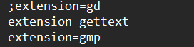

# UTS-Kriptografi

# Implementasi Affine Cipher Sesuai dengan Kiteria

<h3>Dalam iplementasi Affine cipher Menggunakan beberapa fungsi Dalam code</h3>
  Mengenai penjelasan fungsi yang terdapat dalam code yaitu :

  ### Fungsi GCD (Faktor Persekutuan Terbesar)
  - Fungsi `gcd($a, $b)` digunakan untuk menghitung Faktor Persekutuan Terbesar (FPB) dari dua bilangan.
  
  ### Fungsi Mencari Bilangan Coprime
  - Fungsi `findCoprime($m)` mencari bilangan acak (coprime) yang merupakan bilangan bulat positif yang FPB-nya dengan parameter `$m` adalah 1.

  ### Fungsi Invers Modular
  - Fungsi `modular_inverse($a, $m)` menghitung invers modular dari bilangan `$a` modulo `$m` menggunakan Algoritma Extended Euclidean. Hasilnya adalah sebuah bilangan `$x` sehingga `( $a * $x ) % $m = 1`.

  ### Fungsi Enkripsi dengan Metode Affine Cipher
  - Fungsi `affineEncrypt($text, $a, $b)` melakukan enkripsi menggunakan metode Affine Cipher pada teks `$text`. 
  - Dalam enkripsi, setiap karakter huruf kecil digantikan dengan karakter hasil perhitungan dari rumus enkripsi Affine Cipher: `($a * $plaintext_num + $b) % $m`.

  ### Fungsi Dekripsi dengan Metode Affine Cipher
  - Fungsi `affineDecrypt($text, $a, $b)` melakukan dekripsi menggunakan metode Affine Cipher pada teks terenkripsi `$text`.
  - Dalam dekripsi, setiap karakter huruf kecil digantikan dengan karakter hasil perhitungan dari rumus dekripsi Affine Cipher: `($a_inverse * ($ciphertext_num - $b)) % $m`.

  ### Keterangan Tambahan
  - Dalam konteks Affine Cipher, parameter `$a` dan `$b` digunakan sebagai kunci enkripsi atau dekripsi.
  - Fungsi-fungsi ini membantu implementasi Affine Cipher untuk mengamankan dan mendekripsikan teks dengan menggunakan operasi matematika pada huruf-huruf dalam abjad.

### Sebelum itu Extension GMP Dinyalakan Karena di Bagian Fungsi GCD Saya menggunakan GMP Supaya Cepat Kinerjanya

seperti diatas

### login.php

adalah tampilan website login.

### register.php

adalah tampilan website register.

### lupaPassword.php

adalah tampilan website lupa password yang hanya menvalidasi Username dan password jika itu yang punya akun jika iyya akan dilanjutkan ke halaman passwordBaru.php

### passwordBaru.php 

adalah tampilan website Ubah Password, jika password sudah diperbahuri Maka Nila_A dan Nilai_B Di database akan berubah

### Halaman Home

Hanya Tampilan Home pada website hanya memunculkan nama, umur dan email, di dalam menu home ini pengguna dapat ubah profil

### edit.php

berisi tampilan username, umur dan email, jika ingin di ubah tinggal ubah saja 

### ubahKatasandi.php

berisi tampilan password saat ini, password baru dan konfirmasi password. sama seperti halaman passwordBaru.php jika menggati passowrd maka Nilai_A dan Nilai_B Berubah

### Sekian Penjelasananya

<h2 align="center">Thanks For Reading!!!</h2>

